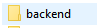

# Projeto---JM-Financas

Sistema inspirado nas aplicações Organizze e Mobills, apresenta funcionalidades com o intuito de facilitar sua organização financeira, com opção de cadastro de gastos, ganhos e valores investidos, graficos interativos, noticias do mundo dos investimentos.

Com o JM Finanças sua vida financeira fica muito mais saudavel e organizada. 

# Tecnologias utilizadas
No projeto foram utilizadas as seguintes tecnologias;

*   ReactJS
*   NextJS
*   NodeJS
*   Scss
*   HTML
*   Axios
*   Prisma

# Abrindo e iniciando projeto

1. Utilie o comando GitClone em um repositório no seu CMD:

        git clone https://github.com/JoaoVMoreira/Projeto-JMeduca.git .

2. Em seguida é necessário iniciar o backend do projeto;
    *   Acessar a pasta BackEnd e utilizar o codigo "yarn dev".
     
    
     
3. Realizar o mesmo procedimento na pasta FrontEnd

4. Em seguida a aplição será iniciada.